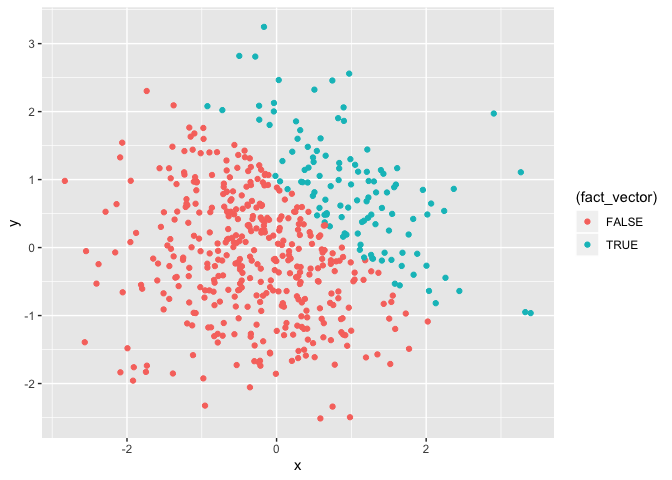

Homework 1
================
Michelle Jen
9/19/2019

``` r
library(tidyverse)
```

    ## ── Attaching packages ───────────────────────────────────────────────────────────── tidyverse 1.2.1 ──

    ## ✔ ggplot2 3.2.1     ✔ purrr   0.3.2
    ## ✔ tibble  2.1.3     ✔ dplyr   0.8.3
    ## ✔ tidyr   0.8.3     ✔ stringr 1.4.0
    ## ✔ readr   1.3.1     ✔ forcats 0.4.0

    ## ── Conflicts ──────────────────────────────────────────────────────────────── tidyverse_conflicts() ──
    ## ✖ dplyr::filter() masks stats::filter()
    ## ✖ dplyr::lag()    masks stats::lag()

# Problem 1

## code chunk 1

Create a data frame comprised of:

  - a random sample of size 8 from a standard Normal distribution
  - a logical vector indicating whether elements of the sample are
    greater than 0
  - a character vector of length 8
  - a factor vector of length 8, with 3 different factor “levels”

<!-- end list -->

``` r
one_df = tibble(
  sample = rnorm(8),
  vec_logical = sample > 0,
  vec_character = c('a','b','c','d','e','f','g','h'),
  vec_factor = factor(c("big","med","small","big","med","small","big","small"))
)
```

Try to take the mean of each variable in your dataframe. What works and
what
    doesn’t?

``` r
mean(pull(one_df, sample))
```

    ## [1] -0.2972714

``` r
mean(pull(one_df, vec_logical))
```

    ## [1] 0.25

``` r
mean(pull(one_df, vec_character))
```

    ## Warning in mean.default(pull(one_df, vec_character)): argument is not
    ## numeric or logical: returning NA

    ## [1] NA

``` r
mean(pull(one_df,vec_factor))
```

    ## Warning in mean.default(pull(one_df, vec_factor)): argument is not numeric
    ## or logical: returning NA

    ## [1] NA

It works to take the mean of a random sample and a logical vector.
However, it doesn’t work to take a mean of a character vector or a
factor vector since they’re not numeric or logical.

## code chunk 2

In a second code chunk:

  - convert the logical vector to numeric, and multiply the random
    sample by the result
  - convert the logical vector to a factor, and multiply the random
    sample by the result
  - convert the logical vector to a factor and then convert the result
    to numeric, and multiply the random sample by the result

<!-- end list -->

``` r
log_num = as.numeric(pull(one_df,vec_logical))
product_num = log_num*pull(one_df, sample)

log_fact = as.factor(pull(one_df, vec_logical))
product_fact = log_fact*pull(one_df, sample) 
```

    ## Warning in Ops.factor(log_fact, pull(one_df, sample)): '*' not meaningful
    ## for factors

``` r
# ‘*’ not meaningful for factors.#
# This makes sense since the factor vector did not yield a mean.# 

fact_num = as.numeric(log_fact)
product_num_random = fact_num*pull(one_df, sample)
```

# Problem 2

Create a data frame comprised of:

  - x: a random sample of size 500 from a standard Normal distribution
  - y: a random sample of size 500 from a standard Normal distribution
  - A logical vector indicating whether x + y \> 1
  - A numeric vector created by coercing the above logical vector
  - A factor vector created by coercing the above logical vector

<!-- end list -->

``` r
two_df = tibble(
  x = rnorm(500),
  y = rnorm(500),
  log_vector = x + y > 1,
  num_vector = as.numeric(log_vector),
  fact_vector = as.factor(log_vector),
)
```

  - the size of the dataset (using nrow and ncol)
  - the mean, median, and standard deviation of x
  - the proportion of cases for which x + y \> 1

<!-- end list -->

``` r
nrow(two_df) # The nrow = 500. #
```

    ## [1] 500

``` r
ncol(two_df) # The ncol = 5. #
```

    ## [1] 5

``` r
mean(pull(two_df, x))
```

    ## [1] -0.01977676

``` r
median(pull(two_df, x))
```

    ## [1] -0.08170201

``` r
sd(pull(two_df, x))
```

    ## [1] 1.010006

``` r
sum(pull(two_df, log_vector)) / 500
```

    ## [1] 0.23

Make a scatterplot of y vs x; color points using the logical variable
(adding color = … inside of aes in your ggplot code should help). Make a
second and third scatterplot that color points using the numeric and
factor variables, respectively, and comment on the color
scales.

``` r
scatterplot_one = ggplot(two_df, aes (x=x, y=y, color = (log_vector))) + geom_point()
print(scatterplot_one + ggtitle("First Scatterplot: Logical Vector")) 
```

<!-- -->

``` r
# The red represents when the logical vector is false, that is x + y =< 1. #
# The blue represents when the logical vector is true, that is x + y > 1. #
ggsave("scatterplot_one.pdf")
```

    ## Saving 7 x 5 in image

``` r
ggplot(two_df, aes (x=x, y=y, color = (num_vector))) + geom_point() 
```

<!-- -->

``` r
# The darker blue represents when the numeric vector is false, that is x + y =<. #
# The lighter blue represents when the numeric factor is true, that is x + y > 1. #
# The scale is continuous since it's a numeric vector but values are either 1 or 0 
# (true or false) so theren't any colors in between. #

ggplot(two_df, aes (x=x, y=y, color = (fact_vector))) + geom_point() 
```

<!-- -->

``` r
# The red represents when the factor vector is false, that is x + y =< 1. # 
# The blue represents when the factor vector is true, that is x + y > 1. #
```
